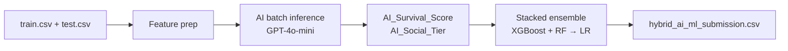

# Titanic — Hybrid AI + ML Survival Predictor

A [Kaggle Titanic](https://www.kaggle.com/competitions/titanic) submission pipeline that combines LLM-generated features with a classical stacked ensemble. An AI layer reasons over passenger demographics to produce survival scores and social-tier estimates; a machine-learning layer (XGBoost + Random Forest → Logistic Regression) trains on those features alongside standard tabular columns to produce final predictions.

## How it works



1. **Load & merge** — Training and test sets are combined so AI features are generated consistently across both.
2. **AI feature generation** — Passengers are processed in batches of 20. Each batch is sent to `gpt-4o-mini` (via GitHub Models) with a structured prompt. The model returns:
   - `ai_survival_probability` → renamed to `AI_Survival_Score`
   - `estimated_social_tier` (`High` / `Medium` / `Low`) → renamed to `AI_Social_Tier`
3. **Classical preprocessing** — Missing values are imputed; categorical fields are label-encoded.
4. **Stacked ensemble** — XGBoost and Random Forest serve as base learners; a Logistic Regression meta-learner combines their outputs (5-fold CV).
5. **Submission** — The model is retrained on the full training set and predictions are written to `hybrid_ai_ml_submission.csv`.

If an API batch fails, the pipeline falls back to neutral defaults (`AI_Survival_Score = 0.5`, `AI_Social_Tier = Medium`).

## Project structure

```
Titanic/
├── data/
│   ├── train.csv              # Kaggle training data
│   ├── test.csv               # Kaggle test data
│   └── gender_submission.csv  # Baseline submission template
├── shared/
│   ├── config.py              # API client & environment config
│   └── schemas.py             # Pydantic schemas for structured AI output
├── Titanic_code/
│   └── ai_checker.py          # Main pipeline script
├── hybrid_ai_ml_submission.csv  # Generated Kaggle submission (output)
├── pyproject.toml
└── uv.lock
```

## Requirements

- Python 3.12+
- [uv](https://docs.astral.sh/uv/) (recommended) or pip
- A GitHub token with access to [GitHub Models](https://github.com/marketplace/models)

## Setup

```bash
# Clone and enter the repo
cd Titanic

# Create virtual environment and install dependencies
uv sync

# Activate the environment
source .venv/bin/activate
```

Create a `.env` file in the project root (or in `shared/`) with your credentials:

```env
GITHUB_TOKEN=your_github_token_here
```

The pipeline uses the GitHub Models inference endpoint (`https://models.inference.ai.azure.com`) with `gpt-4o-mini`. An `OPENAI_API_KEY` is also read by `shared/config.py` but is not required for the current pipeline.

## Usage

Run the full pipeline from the project root:

```bash
python Titanic_code/ai_checker.py
```

The script will:

- Load `data/train.csv` and `data/test.csv`
- Call the AI API in batches (with a 0.5s pause between batches to reduce rate-limit issues)
- Train the stacked ensemble and report local validation accuracy
- Write predictions to `hybrid_ai_ml_submission.csv`

Upload `hybrid_ai_ml_submission.csv` to the [Kaggle competition submission page](https://www.kaggle.com/competitions/titanic/submit).

## Features used by the ML model

| Feature | Source |
|---|---|
| `Pclass`, `Sex`, `Age`, `SibSp`, `Parch`, `Fare`, `Embarked` | Original Titanic columns |
| `AI_Survival_Score` | LLM-estimated survival probability (0.0–1.0) |
| `AI_Social_Tier` | LLM-estimated socio-economic tier |

## Model architecture

| Layer | Model | Key settings |
|---|---|---|
| Base learner 1 | XGBClassifier | 120 trees, lr=0.04, max_depth=4 |
| Base learner 2 | RandomForestClassifier | 150 trees, max_depth=5 |
| Meta learner | LogisticRegression | 5-fold stratified CV stacking |

Local validation uses an 80/20 train/validation split (`random_state=42`) before the final fit on all training data.

## License

This project uses the public [Kaggle Titanic dataset](https://www.kaggle.com/competitions/titanic/data). Check Kaggle's terms of use before redistributing data or submissions.
